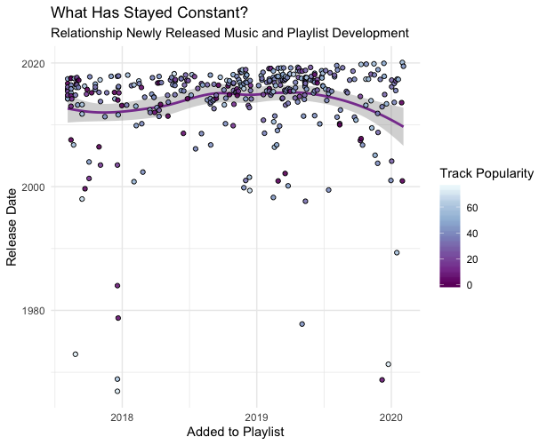

#### Student: Nick ten Broeke
#### Stud. number: 11912219

### Choice of Corpus

The corpus that I have chosen is one of my personally curated playlists, consisting of 406 songs. This particular playlist, called “SN”, is similarly compiled as many of Spotify’s curated playlisted in the sense that it’s not compiled based on genre but rather on a specific mood. Its intention is to be listened to when hanging out, or having dinner with friends. Specifically, I would like to know how the style of this particular playlist has evolved over the years. Did I have different ideas on what fitted the playlist two years ago as opposed to now?

***

### Mean Change

Before I'll look at any visualizations it is important to determine which features changed significantly over the years. Below is a simple line graph that compares two points in time: SN old, comprising of the first 100 added songs in the playlist and SN new, comprising of the latest 100 additions. Red lines in the plot indicate strong effects whereas orange lines describe medium effects.

***

The graph suggests that over time the playlist has become more upbeat as the danceability and valence features have increased over time when comparing SN old with SN new. Only comparing the means however gives little inside how the distribution of these features have developed. 

***

### Changes over Time

Below is a plot that shows how the distribution of the danceability and valence features has shifted over time. The strongest shift can be seen in the valence feature. Whereas the majority of songs added in the beginning of the playlist are categorized as sad, with valences centering between 0.1-0.4, the latest songs added show virtually no focus at this region and include songs that explore the upper end of the continuum. Danceability too, has made a shift, albeit less strong than the valence feature. 
The plot also shows something rather unexpected: the representation of minor/major songs seems virtually unchanged between SN old and SN new, in spite of the clear rise in 'happy' songs. Clearly I need to uncover more about how the sound of SN has evolved over the years, which I will do in coming weeks.

***

***

### Constancy

One possibility as a cause for the above shift in distribution is the influence of newly released music. Possibly the shift in playlist sound has less to do with a change in myself but rather has something to do with what kind of music is being released. The plot below shows that this is probably not the case. The date that songs were added are plotted against the time that they were released to see if there is a relationship between these two variables. The plot shows that over the course of having the playlist I wasn't influenced much by what was being released, nor what was popular at any given time.

***

***

